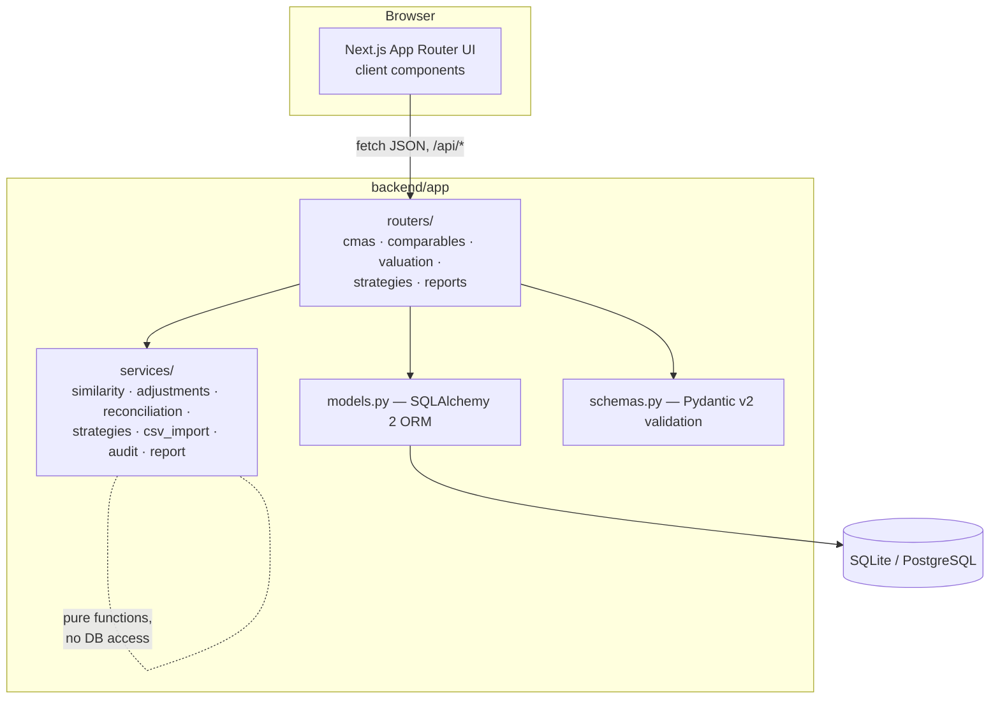
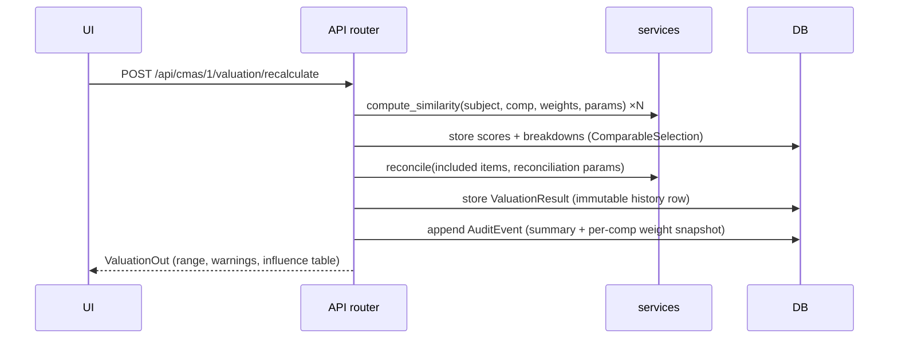
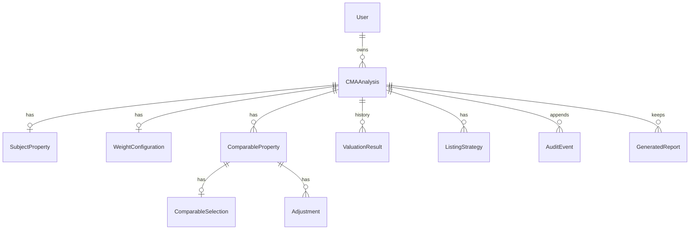

# Architecture

## Overview

A deliberately boring, inspectable monorepo: a typed JSON API over a normalized
relational schema, with every calculation in pure functions.



### Layering rules

| Layer | May do | May not do |
|---|---|---|
| `services/` | Pure calculation on plain values/objects | Touch the DB, FastAPI, or HTTP |
| `routers/` | Validate (Pydantic), orchestrate services, persist, audit-log | Contain calculation formulas |
| `models.py` | Schema + trivial derived properties | Business logic |
| Frontend components | Render props, local UI state | Compute valuation numbers (display-only math like column sums is allowed) |

This is what makes the test suite meaningful: the 79 backend tests hit the
formulas directly, and the API tests only need to verify orchestration.

## Data flow for one valuation



`ValuationResult` rows are never updated — each recalculation appends, so the
audit trail can always point at the exact numbers a report used.

## Entity model



Field-level reference: [DATA_DICTIONARY.md](DATA_DICTIONARY.md).

## Key decisions

| Decision | Choice | Why |
|---|---|---|
| DB default | SQLite file, Postgres optional | Clean-clone-to-running in two commands; SQLAlchemy keeps the switch a URL change |
| Valuation history | Append-only `ValuationResult` | Auditability beats storage cost at this scale |
| Similarity breakdown storage | Full JSON on the selection row | The breakdown *is* the product; recomputing on read would let display drift from what was reconciled |
| Suggested vs manual adjustments | `source` flag; edits re-flag to manual; regeneration only replaces `suggested` | Preserves user work while keeping suggestions refreshable |
| Recency in weights | Only inside similarity | One transparent weight chain; no double counting |
| Auth | None (seeded demo user) | Demo scope; `User` FK everywhere so auth is additive |
| PDF | HTML first, WeasyPrint optional | Native-lib-free clean clone; HTML report is CI-testable |
| Frontend data layer | Typed fetch client, no query library | Small surface; components take props and stay unit-testable |

## Where things live

```
backend/
  app/constants.py      CALC_VERSION, defaults, disclaimer — single source
  app/services/         All math (pure, tested)
  app/routers/          HTTP surface + audit logging
  app/templates/        Report template (Jinja2)
  alembic/              Migrations
  tests/                79 tests incl. full workflow via TestClient
frontend/
  src/lib/              types.ts (API mirror), api.ts (typed client), format.ts
  src/components/       Presentational, prop-driven (tested with RTL)
  src/app/              Routes; pages wire API ↔ components
  e2e/                  Playwright journeys + screenshot capture
```
