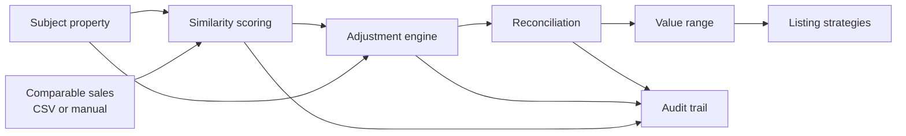

# Valuation Methodology

Version: **calc-v1.0** (stamped on every stored valuation, report, and audit event)

This document is the authoritative description of every calculation the
platform performs. The implementation lives in `backend/app/services/` and is
unit-tested against the examples below. If code and document disagree, that is
a bug.

> **Scope disclaimer.** This is a transparent implementation of the
> *sales-comparison approach* as commonly used in residential brokerage CMAs.
> It is an educational tool — not an appraisal methodology, and none of the
> default numbers below are market standards. Every default is a sample value
> the user is expected to review and change.

## 1. Overview



1. Comparables are scored 0–100 for similarity to the subject (§2).
2. Each comparable's sale price is adjusted for measurable differences (§3).
3. Adjusted values are reconciled into a weighted central estimate and range (§4).
4. Listing strategies are priced off the central estimate with documented heuristics (§5).
5. Every input, override, and recalculation is recorded in the audit trail (§6).

## 2. Similarity scoring

Nine components, each mapped to a 0–100 score with a **linear falloff curve**:
`score = max(0, 1 − |difference| / cap) × 100`. All caps and weights are stored
per-CMA (`WeightConfiguration`) and editable.

| Component | Difference measured | Default cap ("score reaches 0 at") | Default weight |
|---|---|---|---|
| proximity | miles from subject (haversine when both have coordinates, else the stated `distance_from_subject`) | 3.0 mi | 0.20 |
| living_area | sq ft vs subject | 30% of subject sq ft | 0.20 |
| property_type | exact match → 100, else 0 | — | 0.15 |
| recency | months since sale (30.44-day months) | 12 mo | 0.10 |
| bedrooms | count difference | 3 | 0.08 |
| lot_size | sq ft vs subject | 50% of subject lot | 0.08 |
| bathrooms | count difference | 3 | 0.07 |
| age | year-built difference | 30 yr | 0.07 |
| condition | steps on poor→fair→average→good→excellent | 4 steps | 0.05 |

**Total score** = Σ (componentᵢ × effective_weightᵢ), where effective weights are
the configured weights renormalized over the components that could actually be
computed. **Missing data is never guessed**: a component with missing inputs is
excluded, listed in `missing_components`, and the rest of the weights scale up
proportionally. If no weighted component can be computed, the score is null.

The stored breakdown records, per component: configured weight, effective
weight, raw subject/comparable values, the 0–100 score, and its contribution
(effective weight × score). Contributions sum to the total score.

**Worked example.** Subject: 2,000 sq ft. Comp: identical except 1,700 sq ft
and 1.5 mi away. living_area: |1700−2000| / (0.30×2000) = 0.5 → 50.
proximity: 1.5/3.0 = 0.5 → 50. All other components 100. Total =
0.20×50 + 0.20×50 + 0.60×100 = **80.0**. (`tests/test_similarity.py`)

## 3. Adjustments

Standard sales-comparison direction, applied consistently:

* Comparable **inferior** to subject → **positive** amount (comp adjusted **upward**)
* Comparable **superior** to subject → **negative** amount (comp adjusted **downward**)

Suggested adjustments are generated from the per-CMA assumption set
(demonstration defaults, labeled as sample assumptions in the UI and report):

| Category | Formula | Default assumption |
|---|---|---|
| market_time | sale_price × monthly_pct × months since sale | 0.30%/month |
| living_area | (subject_sf − comp_sf) × $/sq ft | $150/sq ft |
| lot_size | (subject_lot − comp_lot) × $/sq ft | $5/sq ft |
| bedrooms | (subject − comp) × $ per bedroom | $10,000 |
| bathrooms | (subject − comp) × $ per bathroom | $12,500 |
| condition | (subject_ordinal − comp_ordinal) × $ per step | $15,000 |
| parking | (subject − comp) × $ per space | $7,500 |
| pool | ±flat amount when only one side has a pool | $25,000 |

Rules:

* A category with missing data on either side is **skipped, never guessed**.
* Setting an assumption to 0 disables that category.
* Users can add manual adjustments, edit any amount (an edited suggested
  adjustment is re-flagged `manual`), or delete adjustments; each action is
  audit-logged. Re-running suggestion replaces only `suggested` rows.

Then, per comparable:

```
adjusted_sale_price          = original_sale_price + Σ(all adjustment amounts)
adjusted_price_per_sq_ft     = adjusted_sale_price / comparable_square_feet   (null if sq ft invalid)
gross_adjustment_pct         = Σ|amount| / sale_price     (reliability indicator)
net_adjustment_pct           = Σ amount  / sale_price
```

**Worked example.** Comp sold $1,000,000; 300 sq ft smaller (+300×150 =
+$45,000); one extra bath (−$12,500); sold 10 months ago (+1,000,000 × 0.003 ×
10.0 ≈ +$29,970). Adjusted ≈ **$1,062,470**. (`tests/test_adjustments.py`)

## 4. Reconciliation

Only **included** comparables participate.

```
raw_weight_i        = (similarity_i / 100) × user_multiplier_i
normalized_weight_i = raw_weight_i / Σ raw_weights
central_estimate    = Σ (adjusted_value_i × normalized_weight_i)
```

Notes on the weight chain: recency already contributes to similarity, so it is
not double-counted; the user multiplier (default 1.0, range 0–10) is the
explicit override lever and every change to it is audit-logged. If all raw
weights are zero, equal weights apply and a warning is recorded. A comparable
with no similarity score participates at full base weight (its data was too
sparse to score — the warning system flags thin analyses separately).

Dispersion and range:

```
weighted_variance = Σ wᵢ (vᵢ − central)²
dispersion        = √weighted_variance          (weighted standard deviation)
low  = central − k × dispersion                 (k default 1.0, configurable)
high = central + k × dispersion
cov  = dispersion / central                     (coefficient of variation)
```

**The low–high band is an analytical estimate, not a statistical confidence
interval**, and is labeled as such everywhere it appears. With a single
comparable the band is a nominal ±5% with an explicit warning.

Also reported: unweighted median adjusted value, weighted adjusted $/sq ft
(over comps with valid sq ft, renormalized), included count, and per-comparable
influence percentages (normalized weights × 100 — these sum to 100%).

Warnings (all thresholds configurable): no comparables · fewer than 3 ·
single-comparable band · cov > 15% · gross adjustments > 25% of sale price ·
sale older than 12 months · adjusted value deviating > 20% from the median.

### 4.1 Assumption sensitivity (read-only what-if)

`GET /api/cmas/{id}/sensitivity` varies each dollar assumption ±20% (relative,
configurable via `variation_pct`), one at a time, and reports how the central
estimate moves. Semantics: suggested adjustments are recomputed per variation
while **manual adjustments are held fixed**; the baseline is reconstructed the
same way so all values are comparable; zero-valued assumptions are skipped;
nothing is persisted or audit-logged (it is a pure read). Items are sorted by
absolute impact so the user sees which assumptions the result actually leans
on. (`tests/test_sensitivity.py`)

## 5. Listing strategies

Three default scenarios priced off the central estimate `V`, rounded to the
nearest $1,000: **Market-Entry** 0.97 V · **Competitive** 1.00 V ·
**Aspirational** 1.05 V. Users can set any price; derived labels update.

Qualitative labels from `d = (list − V) / V`:

| Label | Levels |
|---|---|
| Buyer interest | High (d ≤ −2%) · Moderate (−2% < d ≤ +3%) · Low (d > +3%) |
| Price-reduction risk | Low (d ≤ 0) · Moderate (0 < d ≤ +5%) · High (d > +5%) |

Also shown: dollar/percent distance from V, and the strategy price's position
among included comparables' adjusted values (percentile below the price).

**These are deterministic scenario heuristics.** The platform has no
days-on-market or sale-probability model and makes no such predictions.

## 6. Audit trail

Append-only `AuditEvent` rows record: comparable inclusion/exclusion (with
reasons), adjustment additions/edits/deletions, weight and assumption changes
(before → after), user overrides, valuation recalculations (with the full
per-comparable weight snapshot), strategy changes, report generation — each
with timestamp, actor, plain-language summary, structured details, and the
calculation version.

## 7. Sources and conceptual grounding

The sales-comparison structure (comp selection → paired adjustments → 
reconciliation), the adjustment direction convention, and the use of gross/net
adjustment percentages as reliability indicators follow the approach as
described in standard residential valuation references, e.g. the Appraisal
Institute's *The Appraisal of Real Estate* (15th ed.) and Fannie Mae's Selling
Guide treatment of the sales comparison approach (B4-1.3). This project
borrows the *structure* for educational purposes; it does not implement USPAP
and its outputs are not appraisals. All numeric defaults are original sample
values, not values taken from those sources.

## 8. Known limitations

* Linear similarity curves and additive dollar adjustments are simplifications;
  real markets exhibit non-linear and interacting effects.
* Default assumptions are placeholders; results are only as good as the
  user-reviewed assumptions and comparable data.
* No automated market-trend estimation: the market_time rate is a user input.
* The range is dispersion-based, not a modeled prediction interval.
* Synthetic demo data is illustrative only.
